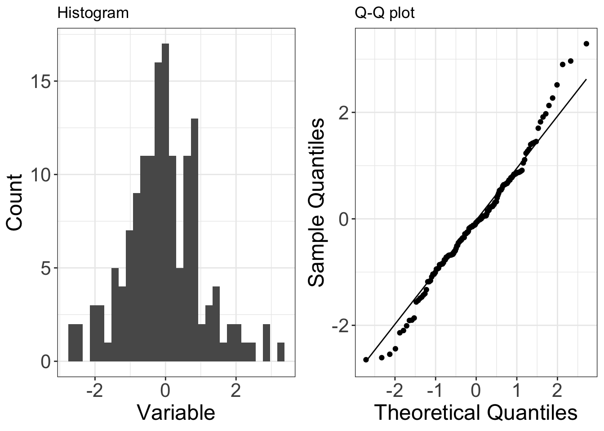
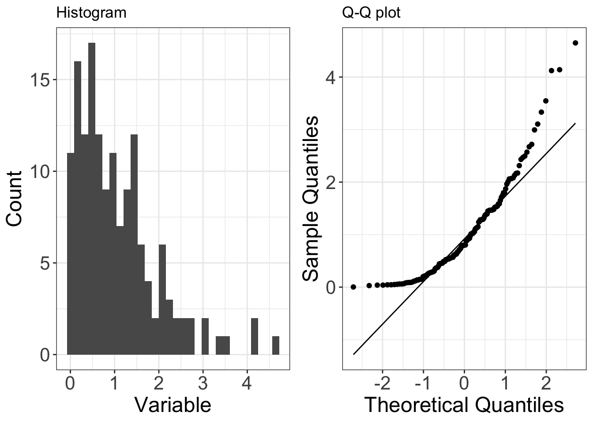
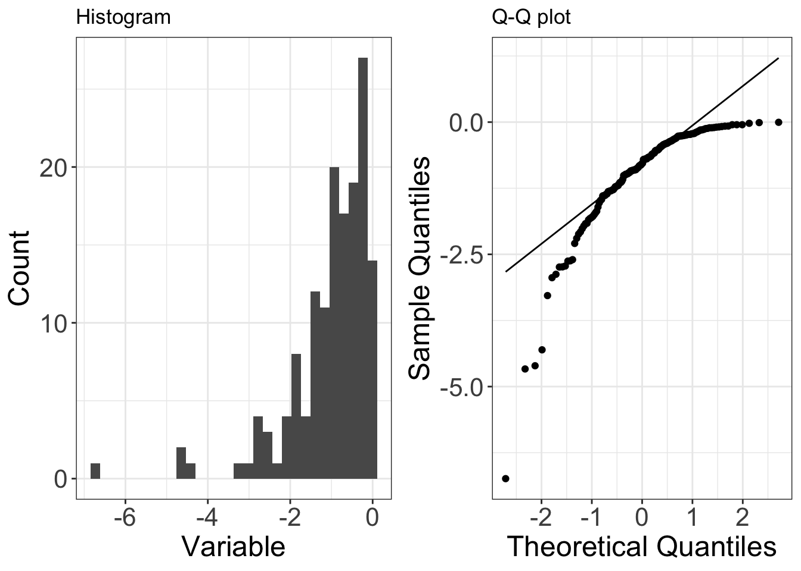
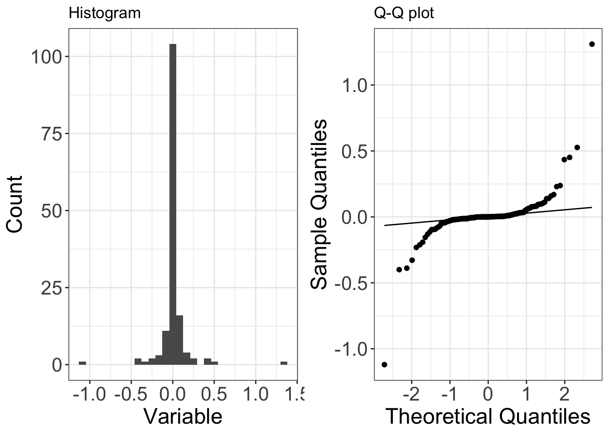

```{r setup, include=FALSE}
knitr::opts_chunk$set(echo = TRUE)
```

Packages you will need for today:

```{r, warning=FALSE, message=FALSE}
library(tidyverse)
library(modelr)
library(car)
library(qqplotr)
library(praise)
library(patchwork)
library(sjPlot)

```


# 1. Mammals

This data set includes data for 39 species of mammals distributed over 13 orders. The data were used for analyzing the relationship between constitutional and ecological factors and sleeping in mammals. Two qualitatively different sleep variables (dreaming and non dreaming) were recorded. Constitutional variables such as life span, body weight, brain weight and gestation time were evaluated. Ecological variables such as severity of predation, safety of sleeping place and overall danger were inferred from field observations in the literature.

Originally published by  T. Allison and D. Cicchetti, "Sleep in mammals: ecological and constitutional correlates," *Arch. Hydrobiol*, vol. 75, p. 442, 1975.

```{r, message=FALSE}
mammals <- read_csv("mammals.csv")

```

# 2. Check and Clean data

As always before working on a dataset you should check it for 

- missing variables

- obvious typos/mistakes

- variables are in the correct data type

- Is it in a tidy format?

# 3. Visualise

the most important part of data analysis is visualising your data. Statistical analysis should always come *after* you have inspected the data and made observations. 

A statistical test is merely an indicator of the likelihood that your pattern/observation in this sample can be generalised to the larger general population. 

## TASK 1

Use `ggpairs()` from the `GGally` package to inspect trends between variables.

Note down relationships and think about whether there are sensible hypotheses that could be tested.

Hints:

- Caution, species is a 50 level factor variable, you will need to remove this from the pairwise plots first otherwise you will receive an error message

- This should not be a substitution for sensible hypothesis forming. You should have a clear idea of *why* you think it is appropriate to test the effect of a dependent variable on an independent variable. 


```{r, message=FALSE, warning=FALSE}
mammals %>% 
  select(!species) %>% 
  GGally::ggpairs()

```

# 4. Explore a relationship: Gestation and adult body weight

We will expore the relationship between the length of gestation and adult bodyweight. 
With the working hypothesis that the length of gestation is a reliable predictor of adult bodyweight across species. 

## Plot the data

```{r, warning=FALSE}
p <- mammals %>% 
  ggplot(aes(x=gestation, y=body_wt))+
  geom_point()+
  ggtitle("Gestation (days) against \n Body Weight (kg)")

p
```

<details><summary>**Questions**

- Does it look like a linear relationship makes sense?

- Do we have any concerns about modeling a linear relationship?

- Any outliers?

- Any initial thoughts on homoscedasticity (equal variance of the residuals across the model?)

</summary>

- Linear relationship: Maybe, though it is difficult to see because of the very narrow distribution of bodyweights across the mammals

- Modeling concerns, definitely - it would be difficult to fit a good least squares line through this data

- Clearly two very large outliers on both gestation and body weight at the high end of the scale

- Also clearly a funnel shape as the values increase, so major concerns there will be heteroscedasticity (unequal residual variance across the fit of our regression). 

</details>

## Model it

Once we’ve decided that a linear relationship makes sense, we’ll model it using lm().

Note that we haven’t checked all assumptions yet. That’s because a lot of our assumptions for linear regression are based on model residuals (e.g. normality & homoscedasticity **of residuals**), which we can’t calculate until after we find the predicted values from the model ($residual = y~actual−y~predicted$).

So let's make our first model

```{r, echo=T, class.source = "fold-show"}
gestation_model <- lm(body_wt~gestation, data=mammals)
summary(gestation_model)
```
From this model we calculate that the 

- slope of the line is 4.12

- the y-intercept is -374.97


Getting this information out of the summary can be messy. we can also use `broom::tidy()` to get the model outputs in a nice dataframe format

```{r}
tidy_gestation <- broom::tidy(gestation_model, conf.int=T)
tidy_gestation
```

Extract the intercept

```{r}
tidy_gestation$estimate[1]

```

Extract the slope
```{r}
tidy_gestation$estimate[2]

```
What about the other parts of the model information (degrees of freedom, F-statistic, p-value) etc?

Here it is easier to use `broom::glance()`

```{r}
glance_gestation <- broom::glance(gestation_model)
glance_gestation
```

To find the predicted values and the residuals for each species adult body weight for their gestation period, we can use `broom::augment()`

```{r}
augment_gestation <- broom::augment(gestation_model, interval="confidence")
augment_gestation
```

# 5. Model assumptions 

Let’s use this information from `augment_gestation` to manually evaluate some assumptions.

- Linearly related variables (CHECK - already looked & thought about this before starting)

- Normally distributed residuals

- Homoscedasticity (constant residuals variance)

- Influential outliers


Remember we are working with generalised linear models. They can be tolerant to minor deviations from these assumptions, but if our assumptions are too severely violated then our regression may be a poor fit and our ability to determine significance, build confidence intervals and make predictions will be poor. 

## 5.1. Residuals distribution

A major assumption of linear regression is that the residuals are normally distributed. The standardised residuals for our model ($y ~actual~ −y ~predicted~$) are stored in the $.std.resid column from the broom::augment() function.

Here we create a histogram and QQ plot of the residuals

```{r, warning=FALSE, message=FALSE}
augment_gestation %>% 
ggplot(aes(x = .std.resid)) +
  geom_histogram()+
  ggtitle("Histogram of the model residuals")
```

```{r}
augment_gestation %>%
ggplot(aes(sample = .std.resid)) +
   geom_qq()+
  stat_qq_line()+
  ggtitle("QQ plot")
 
```
Overall these don't look great, and there appears to be at least one outlier. 
This looks like an example of an overall left-skew with one extreme outlier, check below and see if you agree?

You could do a formal test of normality (Shapiro-Wilke etc.) but these tests tell you nothing about the actual distribution of your data, and are often confounded by sample size. 

<details><summary>**Understanding QQ plots**</summary>


If you need a refresher on how QQ-plots are made I suggest you go on a quick [StatQuest](https://www.youtube.com/watch?v=okjYjClSjOg) 

But below are some typical examples of quantile-quantile plots and how they line up against histogram distributions

**Normally distributed data**

Below is an example of data (150 observations) that are drawn from a normal distribution. The normal distribution is symmetric, so it has no skew (the mean is equal to the median).

On a Q-Q plot normally distributed data appears as roughly a straight line (although the ends of the Q-Q plot often start to deviate from the straight line).

```{r}


```

**Right-skewed data**

Below is an example of data (150 observations) that are drawn from a distribution that is right-skewed (in this case it is the exponential distribution). Right-skew is also known as positive skew.

On a Q-Q plot right-skewed data appears curved.

```{r}


```

**Left-skewed data**

Below is an example of data (150 observations) that are drawn from a distribution that is left-skewed (in this case it is a negative exponential distribution). Left-skew is also known as negative skew.

On a Q-Q plot left-skewed data appears curved (the opposite of right-skewed data).

```{r}


```

**Under-dispersed data**

Below is an example of data (150 observations) that are drawn from a distribution that is under-dispersed relative to a normal distribution (in this case it is the uniform distribution). Under-dispersed data has a reduced number of outliers (i.e. the distribution has thinner tails than a normal distribution). Under-dispersed data is also known as having a platykurtic distribution and as having negative excess kurtosis.

On a Q-Q plot under-dispersed data appears S shaped.

```{r}
knitr::include_graphics("img/underdispersed.png")

```

**Over-dispersed data**

Below is an example of data (150 observations) that are drawn from a distribution that is over-dispersed relative to a normal distribution (in this case it is a Laplace distribution). Over-dispersed data has an increased number of outliers (i.e. the distribution has fatter tails than a normal distribution). Over-dispersed data is also known as having a leptokurtic distribution and as having positive excess kurtosis.

On a Q-Q plot over-dispersed data appears as a flipped S shape (the opposite of under-dispersed data).

```{r}


```


</details>

## 5.2. Homoscedasticity

The assumption of homoscedasticity means that we assume relatively constant variance of residuals. Does it look like the variance (spread) of residuals changes over the span of the model?

Violations of homoscedasticity may lead to wrongly large or small errors (and our confidence intervals) associated with coefficients, but will not affect the model estimates (coefficients) themselves.

Here, we’ll look at the residuals (actual, and standardized) over the course of the fitted values to see if the spread of the residuals is changing notably:

```{r}
augment_gestation %>%
ggplot(aes(x=.fitted, y= .std.resid)) +
   geom_point()+
  ggtitle("Standardised residuals against Fitted values from the model")
```


```{r}
augment_gestation %>%
ggplot(aes(x=.fitted, y= .resid)) +
   geom_point()+
  ggtitle("Residuals against Fitted values from the model")
```
Note that while the pattern is identical, the scale is very different. That is because your residuals are on the original scale of the dependent variable, whereas your standardised residuals have been fitted onto a distribution of standard deviations. 

Here we can see there is clearly both an increase in the variance of the residuals as the fitted values increase AND there is a clear trend in the residuals. Not looking good! 

Remember what we WANT to see is no trends here and an even distribution of the residuals - this would indicate our model has explained most or all of the linear pattern, and has an equal amount of error along the regression. 

## 5.3. Cook's Distance (influential outliers)

If Cook’s D is greater than $\frac{4}{n}$ for any observation, where $n$ is the number of observations used to create the model, then that observation is strongly influential. This does NOT mean you should just remove that observation. In fact, you should plan on leaving all observations in unless you have really good reason not to.

In our example (mammals), $n$ = 62, so the threshold for a second look is $\frac{4}{62}$. Let’s make & store that as a variable here:

```{r, results="hide"}
cook_limit <- as.numeric(4 / count(augment_gestation))
### I use the augmented dataframe in case any NA values were dropped while fitting the model. 
cook_limit
```
Let's take a look at the Cook's distance for each of our observations. (Which is already included as a variable .cooksd in our augmented model)
```{r}
augment_gestation %>% 
ggplot(aes(x = as.numeric(rownames(augment_gestation)), y = .cooksd)) +
  geom_col() +
  geom_hline(yintercept = cook_limit,
             color = "red",
             linetype = "dashed")+
    ggtitle("Cook's Distance")

```

Because of the scale, it is difficult to see exactly how many influential outliers we might have, but we have at least **ENORMOUS** point of leverage, in fact because we have ordered the plot on the x-axis by row name, we can see that it is the first row in our data frame. 

Data points which cross Cook's distance can have too much influence on the fit of our model. But Cook’s distance should **NOT** be a binary decision making tool to decide whether or not a value should be considered an outlier, or excluded from a dataset.

You should have a very compelling reason to believe that an observation is not representative of the population that you are trying to study (e.g. measurement error, mislabeled sample, etc.) before you even consider removing it. Your default should be to keep everything. How different a point is from the others is not a good enough reason to remove it from your analyses.


## 5.4. Modelling predictions and residuals

Finally we can also check how well our Regression line fits the pattern of our dataset & we can look at the pattern of our residuals against the dependent variable.

```{r}
augment_gestation %>% 
  ggplot(aes(x=gestation, y=body_wt))+
  geom_line(aes(x=gestation, y=.fitted))+
  geom_line(aes(x=gestation, y=.upper), linetype="dashed")+
  geom_line(aes(x=gestation, y=.lower), linetype="dashed")+
  geom_point()+
  ggtitle("Linear trend")

```

## 5.5. Take-home message

Without visualising  your model fitted and residual values and checking whether it violates assumptions we would have a difficult time recognising this model is a poor fit for our data.

So what can we do about this?


# 6. Refit your model

If we think there is still a relationship in our data worth exploring we can attempt to force our residuals into a more normal distribution. One way we can do this is by transforming data and producing a closer approximation of a linear relationship

## TASK 2

<details><summary>**Think about what a suitable transformation MIGHT be, and HOW you would check this - then CLICK HERE**</summary>


We can clearly see that neither of our datasets has a normal distribution

The gestation plot almost looks like *half* a bell curve,as the data is obviously bounded at zero (we cannot have a negative gestation period).

The body weight plot clearly has some extreme outliers and a very 'peaky' distribution. 
```{r, message=FALSE, warning=FALSE}
plot1 <- mammals %>% 
  ggplot(aes(gestation))+
  geom_histogram()+
  ggtitle("Gestation")

plot2 <- mammals %>% 
  ggplot(aes(body_wt))+
  geom_histogram()+
  ggtitle("Body weight")

plot1+plot2

```

We don't HAVE to transform all of our variables to make a better model fit. In fact when you start including MULTIPLE independent variables, you can make life a lot if you can just transform the dependent variable.

Let's take a look

```{r, warning=FALSE, message=FALSE}

plot3 <- mammals %>% 
  ggplot(aes(log10(body_wt)))+
  geom_histogram()

plot4 <- mammals %>% 
  ggplot(aes(x=gestation, y=log10(body_wt)))+
  geom_point()

(plot2+p)/(plot3+plot4)
```
Ok let's try and fit a new model with a *Log~10~* transformation of our dependent variable

```{r}
log10_model <- lm(log10(body_wt)~gestation, data=mammals)
summary(log10_model)
```
## TASK 3

<details><summary>**Recheck the fit of your model:  see if you can do this by yourself BEFORE clicking here**</summary>


```{r}
augment_log10_model <- broom::augment(log10_model, interval="confidence")

plot5 <- 
  augment_log10_model %>% 
  ggplot(aes(x = .std.resid)) +
  geom_histogram()+
  ggtitle("")

plot6 <- 
  augment_log10_model %>%
  ggplot(aes(sample = .std.resid)) +
  qqplotr::stat_qq_band()+
   geom_qq()
  #### from the qqplotr package allows us to add a confidence interval to our qqplot line. Can make it easier to see whether minor deviations are acceptable
 

plot7 <- 
  augment_log10_model %>%
  ggplot(aes(x=.fitted, y= .std.resid)) +
   geom_point()+
  ggtitle("")

plot8 <- 
  augment_log10_model %>%
  ggplot(aes(x = as.numeric(rownames(augment_gestation)), y = .cooksd)) +
  geom_col() +
  geom_hline(yintercept = cook_limit,
             color = "red",
             linetype = "dashed")+
    ggtitle("")

plot9 <- 
augment_log10_model %>% 
  ggplot(aes(x=gestation, y=`log10(body_wt)`))+
  geom_line(aes(x=gestation, y=.fitted))+
  geom_line(aes(x=gestation, y=.upper), linetype="dashed")+
  geom_line(aes(x=gestation, y=.lower), linetype="dashed")+
  geom_point()+
  ggtitle("")

((plot5+plot6)/(plot7+plot8))
```
From this we can now see that we have

1) a Normal distribution to our residuals

2) Removed patterns in our residuals against fitted, and greatly reduced heteroscedasticity (variance along the fit of our regression line)

3) We still have two influential outliers but on a much reduced scale. 


An alternate approach to make those graphs (that you’re more likely to use, and is fine): Just get the diagnostic plots using `plot(model_name)`:

```{r}
par(mfrow=c(2,2))
plot(log10_model)
```

Now that we’ve explored the assumptions and have decided that our linear regression is now a valid tool to describe the relationship between gestation and bodyweight, let’s look at the model.

```{r}
plot9+ggtitle("Linear trend")
  
```

</details>

## TASK 4

<details><summary>**Write a brief summary of your best-fit model - Click here for my version**

Note you will need to include details from the summary, or run `broom::glance()` and `broom::tidy()` on the new model

Things to include: 

- Mention the data transformation

- Describe the slope of the regression

- F statistic, degrees of freedom and P-value

- The variance explained by the model

</summary>


```{r, class.source = "fold-show"}
broom::tidy(log10_model, conf.int=T)
```


```{r, class.source = "fold-show"}
broom::glance(log10_model)
```

A simple linear regression was used to explore the relationship between gestation in days and the average adult body weight across mutliple mammalian species. A log~10~ transformation was applied to the mammalian bodyweight variable in order to better approximate a linear fit for the regression. A significant regression equation was found $\beta$ = 0.007(95%CI: 0.006-0.009), *F*~1,56~ = 80.24, *P* < 0.001, with an *R^2* of 059.   

If we want to report the full summary table of our model (which is often useful). Then we can use the excellent `sjPlot` package and `tab_model()`to produce neat and customisable *html* tables. (Very useful when writing up your report in RMarkdown).

And note how it emphasises 95% Confidence Intervals of the Mean Difference.  

```{r, class.source = "fold-show"}
sjPlot::tab_model(log10_model)
```

</details>

# 7. Making predictions at new points

We might want to conside using our model to make predicitons for **new** values of the predictor variable.

Let's make a dataframe of *new* gestation perios then feed that to our linear model to make predictions for adult body weight.

**Note** I am using the function `predict()` not `fitted()` so that I can add a new dataset to our model. I also need to make sure that my new dataframe supplies variables that have the same names as those included in the model

```{r, class.source = "fold-show"}
new_df <- data.frame(gestation=c(600,45,270))

prediction <- predict(log10_model, new_df)
prediction
```


<details><summary>**Question - Why are these values not what we would expect for bodyweights?**</summary>

Because our prodel predicts the log~10~ value of the adult bodyweight, we need to back transform our predictions onto their original scale.

```{r, class.source = "fold-hide"}
10^prediction
```
</details>


# 8. Find Pearson's *r* for correlation:

The coefficient of determination or $R^2$, tells us how much of the variance in the dependent variable is explained by the model.

We might also just want to explore the strength of the overall correlation (degree of relationship) between two variables which, for two linearly related continuous variables, can be expressed using Pearson’s $r$. 

Pearson’s r ranges in value from -1 (perfectly negatively correlated - as one variable increases the other decreases) to 1 (perfectly positively correlated - as one variable increases the other increases). A correlation of 0 means that there is no degree of relationship between the two variables.

Typical guidelines look something like this (there’s wiggle room in there):

$r$ = 0: no correlation
$r$ < |0.3|: weak correlation
$r$ between |0.3| and |0.7|: moderate correlation
$r$ > |0.7|: strong correlation

We’ll use the `cor.test()` function, adding the two vectors (body weight and body height) as the arguments. The function reports the Pearson’s $r$ value, and performs a hypothesis test with null hypothesis that the correlation = 0.

The distinction is that this test does not imply that one variable is directly affected by the other, simply that appear to change together

```{r, class.source = "fold-show"}
my_cor <- cor.test(log10(mammals$body_wt), mammals$gestation)
my_cor
```
Here, we see that there is a strong positive correlation between body weight and gestation width ($r$ = 0.77, *t*~56~ = 8.96, *P* < 0.001). 

# 9. Extension exercises

This would be a good opportunity for you to try some exploratory data analysis and model fitting. Pick other sensible variables for which you can produce a hypothesis for a relationship with a dependent and independent variable. 

## TASK 5 - Fit a model, test your residuals and if needed included a data transformation. 

- Usually this would be applied to the dependent variable

- It could be applied to the independent variable if needed

- There are many different types of data transformation including but not limited to:
    - natural log
    - square root
    
If you attempt another model fit, you can upload your model checks and a short description of what you did to Blackboard > Stats discussion board and I will give you feedback. 

# END

In future sessions we will look at other types of distributions including *count* and *binomial* data. 

Practice your GitHub control:  Stage, Commit and Push these changes to your Repo. 


